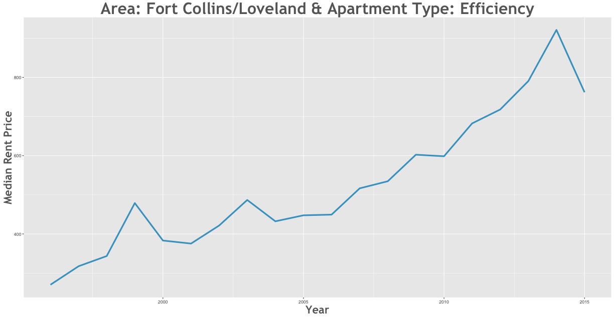

Rent Prices in Colorado 1996 - 2015
================

Is the rent is too damn high in Colorado? Let's analyze data from the [data.coloardo.gov](https://data.colorado.gov/) [Rent database](https://data.colorado.gov/Housing/Rents-by-Type-of-Apartment-in-Colorado/cmr9-ue2w) and find some afforable places to rent around Colorado.

Rent Changes Over Time
----------------------

### How have rents increased between 1996 and 2015?

Efficiency apartments in Fort Collins/Loveland saw the largest increase in rent between 1996 and 2015. During this 19 year period, rent rose 226.5% from $239.26 to $781.18.

### How have rents decreased between 1996 and 1996?

3 Bed apartments in Aspen saw the largest decrease in rent between 1996 and 1996. During this 0 year period, rent fell -40.31% from $1600 to $751.89.

### As of 2015, what are rent prices?

The most expensive apartment to rent is a 1 bed in Boulder/Broomfield which goes for $2008.62 per month.

On the opposite end of the sepectrum, you can rent a very affordable efficiency in Grand Junction for $258.78 per month!

