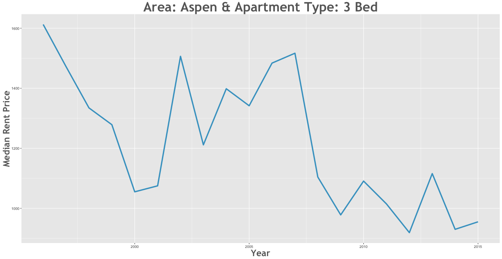
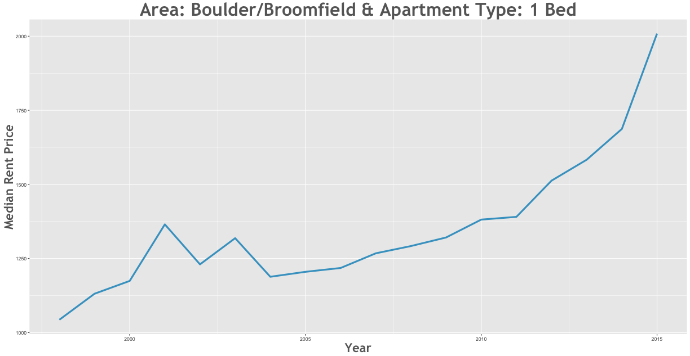
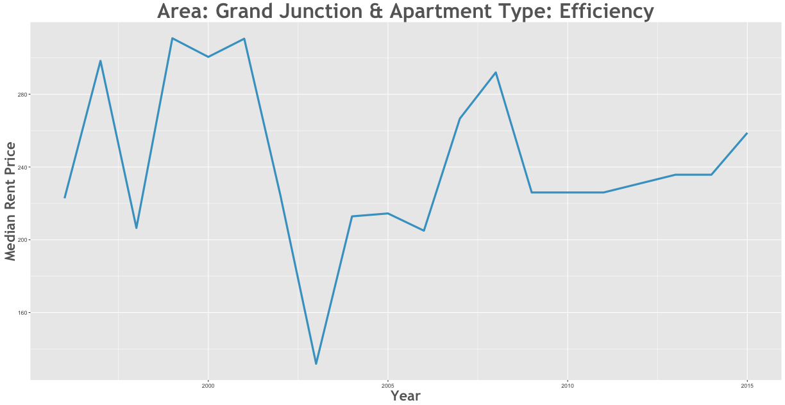

Rent Prices in Colorado 1996 - 2015
================

Is the rent is too damn high in Colorado? Let's analyze data from the [data.coloardo.gov](https://data.colorado.gov/) [Rent database](https://data.colorado.gov/Housing/Rents-by-Type-of-Apartment-in-Colorado/cmr9-ue2w) and find some afforable places to rent around Colorado.

Rent Changes Over Time
----------------------

### How have rents increased between 1996 and 2015?

Efficiency apartments in Fort Collins/Loveland saw the largest increase in rent between 1996 and 2015. During this 19 year period, rent rose 226.5% from $239.26 to $781.18.

### How have rents decreased between 1996 and 1996?

3 Bed apartments in Aspen saw the largest decrease in rent between 1996 and 1996. During this 19 year period, rent fell -40.31% from $1600 to $751.89.

### As of 2015, what are rent prices?

The most expensive apartment to rent is a 1 bed in Boulder/Broomfield which goes for $2008.62 per month.

On the opposite end of the sepectrum, you can rent a very affordable efficiency in Grand Junction for $258.78 per month!

Full Analysis
-------------

| subregion             | file                                                         |
|:----------------------|:-------------------------------------------------------------|
| Alamosa               | [Alamosa](../analysis/alamosa.md)                            |
| Aspen                 | [Aspen](../analysis/aspen.md)                                |
| Buena Vista           | [Buena Vista](../analysis/buenavista.md)                     |
| Canon City            | [Canon City](../analysis/canoncity.md)                       |
| Central Mountains     | [Central Mountains](../analysis/centralmountains.md)         |
| Colorado Springs      | [Colorado Springs](../analysis/coloradosprings.md)           |
| Durango               | [Durango](../analysis/durango.md)                            |
| Eagle County          | [Eagle County](../analysis/eaglecounty.md)                   |
| Fort Collins/Loveland | [Fort Collins/Loveland](../analysis/fortcollinsloveland.md)  |
| Fort Morgan/Brush     | [Fort Morgan/Brush](../analysis/fortmorganbrush.md)          |
| Glenwood Springs      | [Glenwood Springs](../analysis/glenwoodsprings.md)           |
| Greeley               | [Greeley](../analysis/greeley.md)                            |
| Grand Junction        | [Grand Junction](../analysis/grandjunction.md)               |
| Gunnison              | [Gunnison](../analysis/gunnison.md)                          |
| Lake County           | [Lake County](../analysis/lakecounty.md)                     |
| Montrose              | [Montrose](../analysis/montrose.md)                          |
| Pueblo                | [Pueblo](../analysis/pueblo.md)                              |
| Salida                | [Salida](../analysis/salida.md)                              |
| Southeastern Colorado | [Southeastern Colorado](../analysis/southeasterncolorado.md) |
| Steamboat Springs     | [Steamboat Springs](../analysis/steamboatsprings.md)         |
| Sterling              | [Sterling](../analysis/sterling.md)                          |
| Summit County         | [Summit County](../analysis/summitcounty.md)                 |
| Adams                 | [Adams](../analysis/adams.md)                                |
| Arapahoe              | [Arapahoe](../analysis/arapahoe.md)                          |
| Boulder/Broomfield    | [Boulder/Broomfield](../analysis/boulderbroomfield.md)       |
| Denver                | [Denver](../analysis/denver.md)                              |
| Jefferson             | [Jefferson](../analysis/jefferson.md)                        |
| Metro Average         | [Metro Average](../analysis/metroaverage.md)                 |
