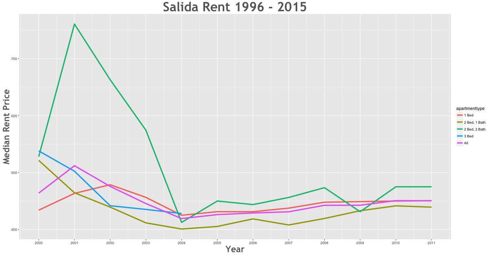

Rent Prices in Salida 1996 - 2015
================

Something like: Between the 2000 and the 2011 rent decreased by -1.68% in the Salida area.

\*\* Questions:

1.  How much did rent increase over all during this time period?
2.  Which apartment type had the higest rent increase?
3.  Which apartment type had the lowest rent increase?
4.  Did rent decrease? If so, by how much?
