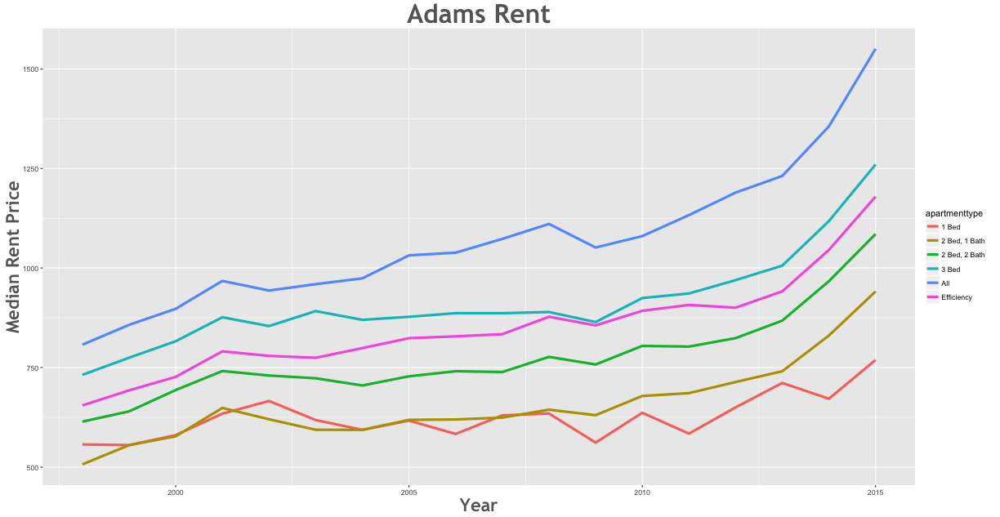

Rent Prices in Adams 1996 - 2015
================

Between the 1998 and the 2015 rent increased by 126.35% in the Adams area.

Further Questions To Ask:
-------------------------

1.  Which apartment type had the higest rent increase?
2.  Which apartment type had the lowest rent increase?
3.  Did rent decrease? If so, by how much?
