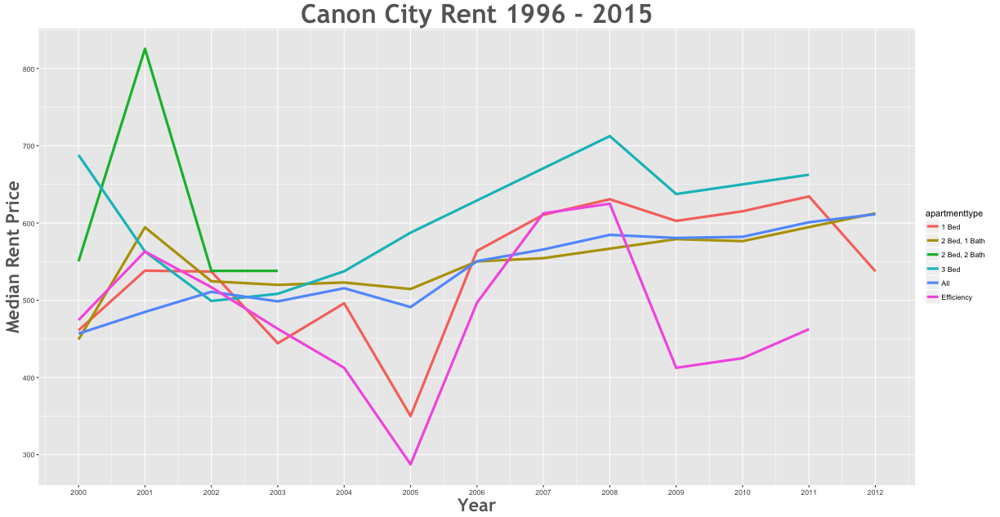

Rent Prices in Canon City 1996 - 2015
================

Between the 2000 and the 2012 rent increased by 33.83% in the Canon City area.

Smallest Rent Delta
-------------------

| subregion  | apartmenttype |  delta|
|:-----------|:--------------|------:|
| Canon City | 3 Bed         |  -3.71|

Largest Rent Delta
------------------

| subregion  | apartmenttype |  delta|
|:-----------|:--------------|------:|
| Canon City | 2 Bed, 1 Bath |  36.36|

