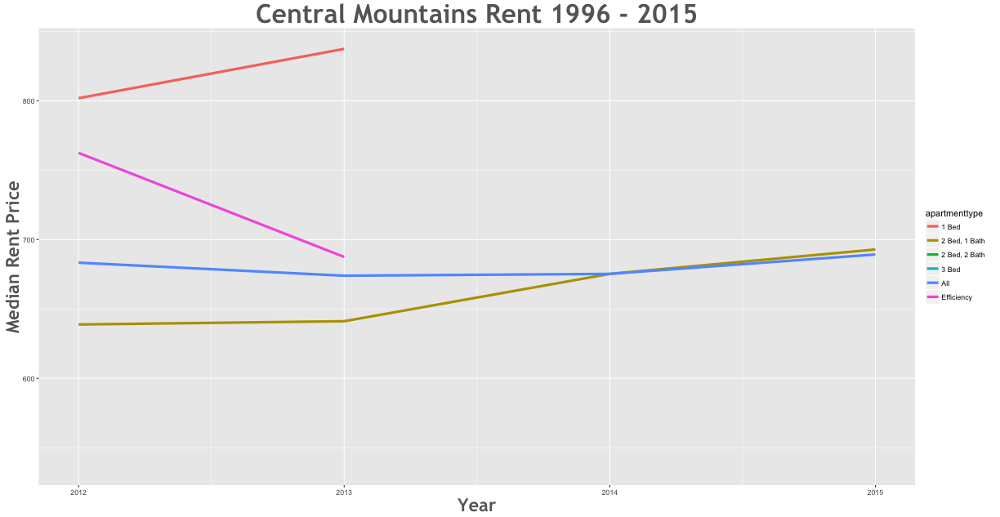
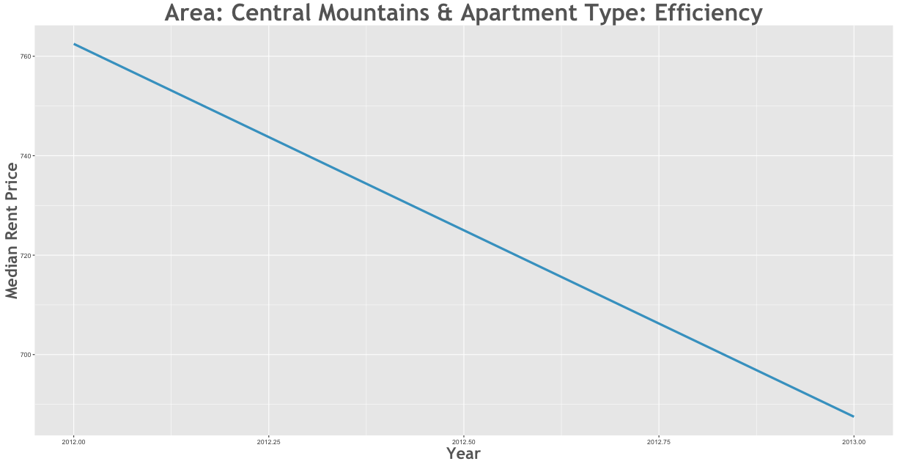

Rent Prices in Central Mountains 1996 - 2015
================

Between the 2012 and the 2015 rent increased by 6.52% in the Central Mountains area.

Smallest Rent Delta
-------------------

| subregion         | apartmenttype |  delta|
|:------------------|:--------------|------:|
| Central Mountains | Efficiency    |  -3.28|

Largest Rent Delta
------------------

| subregion         | apartmenttype |  delta|
|:------------------|:--------------|------:|
| Central Mountains | 2 Bed, 1 Bath |  13.96|

