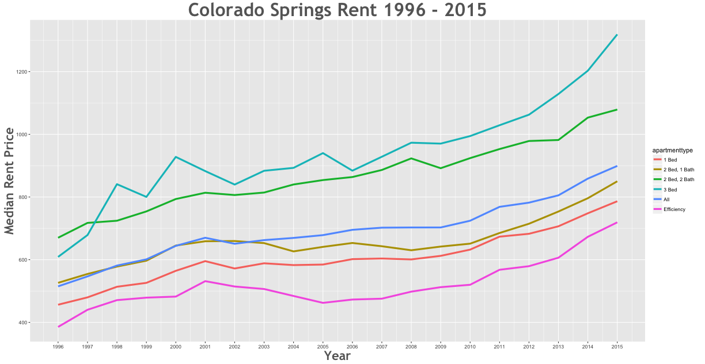

Rent Prices in Colorado Springs 1996 - 2015
================

Between the 1996 and the 2015 rent increased by 87.51% in the Colorado Springs area.

Smallest Rent Delta
-------------------

| subregion        | apartmenttype |  delta|
|:-----------------|:--------------|------:|
| Colorado Springs | 2 Bed, 2 Bath |  71.08|

Largest Rent Delta
------------------

| subregion        | apartmenttype |   delta|
|:-----------------|:--------------|-------:|
| Colorado Springs | 3 Bed         |  120.38|

