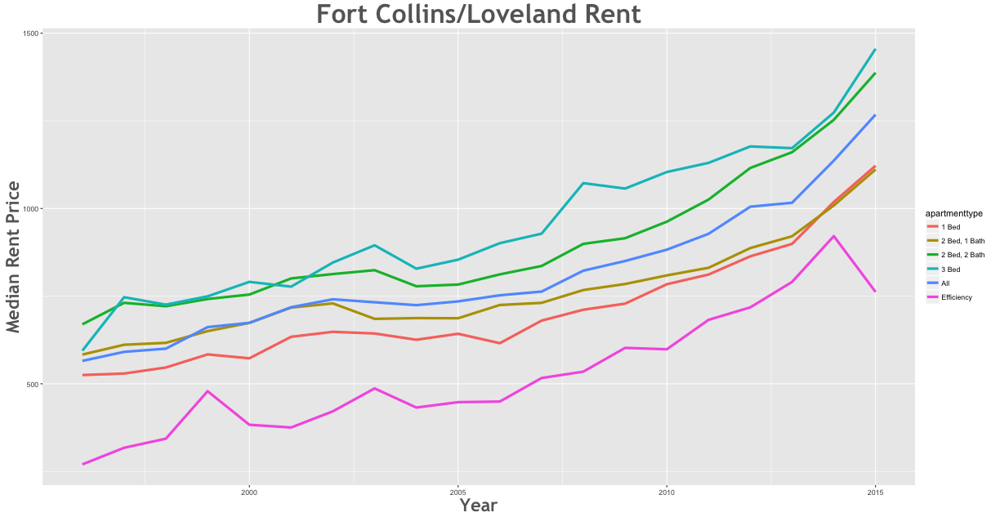
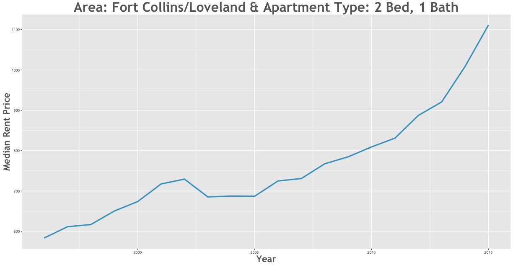

Rent Prices in Fort Collins/Loveland 1996 - 2015
================

Between the 1996 and the 2015 rent increased by 133.34% in the Fort Collins/Loveland area.

Smallest Rent Delta
-------------------

| subregion             | apartmenttype |  delta|
|:----------------------|:--------------|------:|
| Fort Collins/Loveland | 2 Bed, 1 Bath |  93.48|

Largest Rent Delta
------------------

| subregion             | apartmenttype |  delta|
|:----------------------|:--------------|------:|
| Fort Collins/Loveland | Efficiency    |  226.5|

