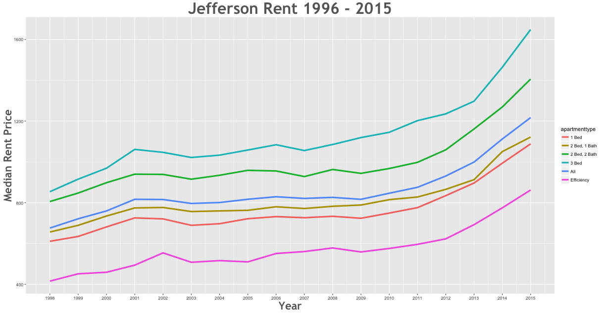

Rent Prices in Jefferson 1996 - 2015
================

Between the 1998 and the 2015 rent increased by 94.22% in the Jefferson area.

\*\*Further Questions To Ask:

1.  How much did rent change over all during this time period?
2.  Which apartment type had the higest rent increase?
3.  Which apartment type had the lowest rent increase?
4.  Did rent decrease? If so, by how much?
