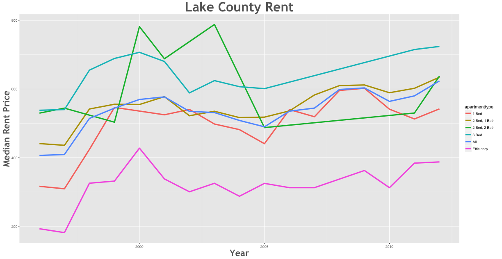
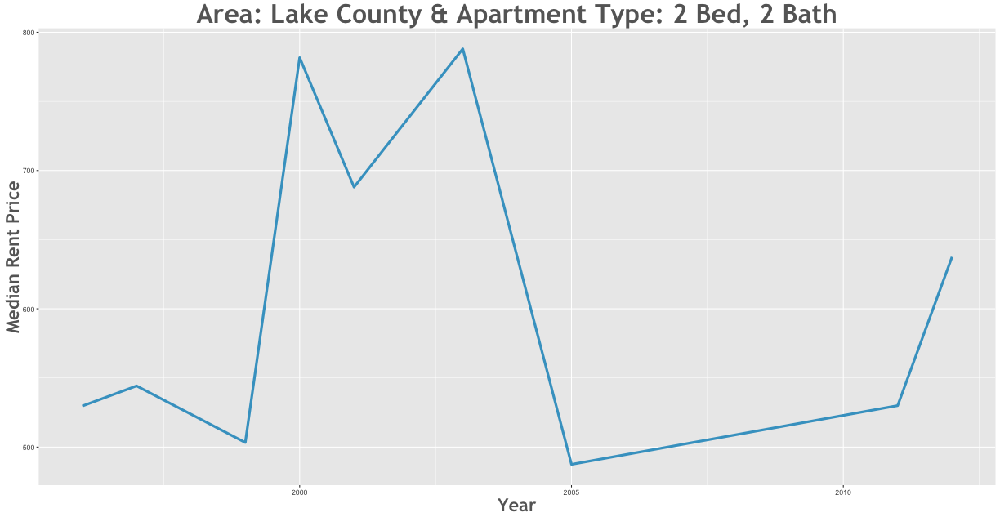

Rent Prices in Lake County 1996 - 2015
================

Between the 1996 and the 2012 rent increased by 53.42% in the Lake County area.

Smallest Rent Delta
-------------------

| subregion   | apartmenttype |  delta|
|:------------|:--------------|------:|
| Lake County | 2 Bed, 2 Bath |  20.36|

Largest Rent Delta
------------------

| subregion   | apartmenttype |   delta|
|:------------|:--------------|-------:|
| Lake County | Efficiency    |  100.99|

