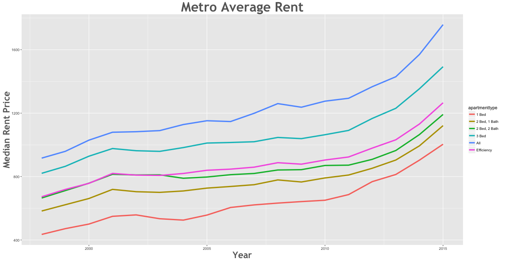
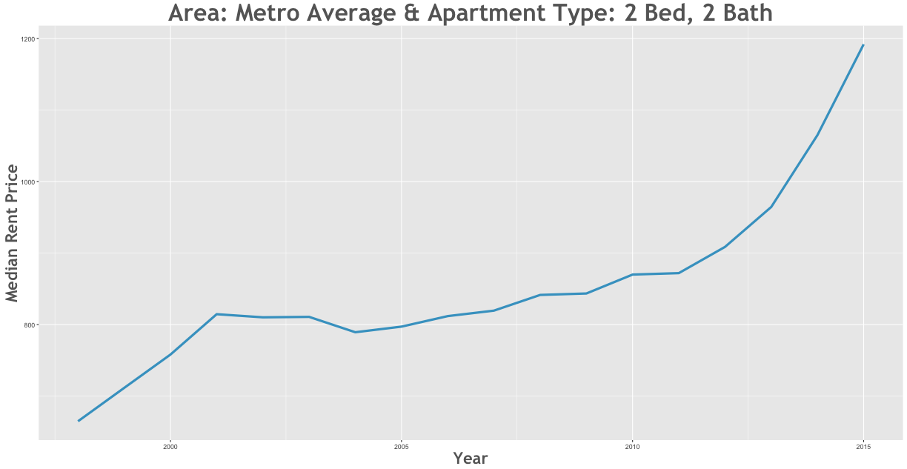

Rent Prices in Metro Average 1996 - 2015
================

Between the 1998 and the 2015 rent increased by 107.74% in the Metro Average area.

Smallest Rent Delta
-------------------

Largest Rent Delta
------------------

