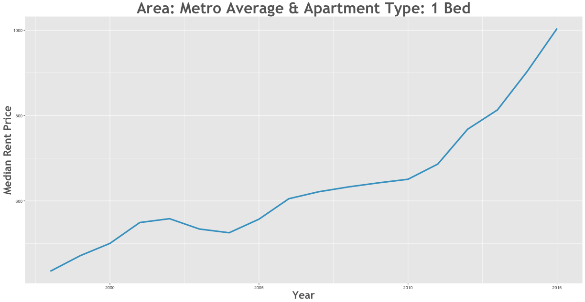

Rent Prices in Metro Average 1996 - 2015
================

Between the 1998 and the 2015 rent increased by 107.74% in the Metro Average area.

Smallest Rent Delta
-------------------

| subregion     | apartmenttype |  delta|
|:--------------|:--------------|------:|
| Metro Average | 2 Bed, 2 Bath |  88.17|

Largest Rent Delta
------------------

| subregion     | apartmenttype |   delta|
|:--------------|:--------------|-------:|
| Metro Average | 1 Bed         |  148.02|

