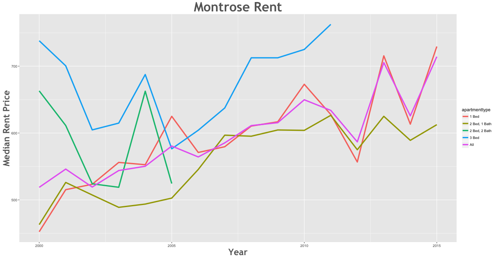
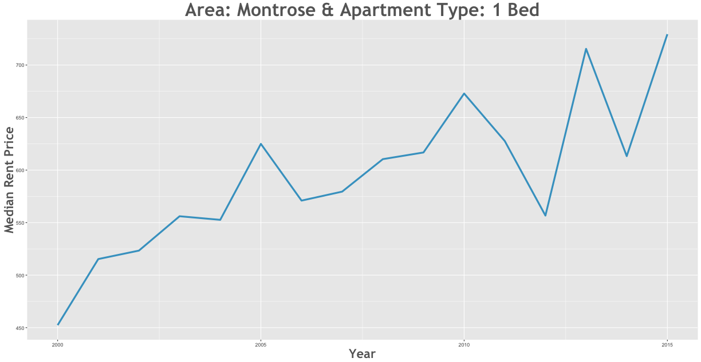

Rent Prices in Montrose 1996 - 2015
================

Between the 2000 and the 2015 rent increased by 38.38% in the Montrose area.

Smallest Rent Delta
-------------------

| subregion | apartmenttype |  delta|
|:----------|:--------------|------:|
| Montrose  | 2 Bed, 2 Bath |  -19.1|

Largest Rent Delta
------------------

| subregion | apartmenttype |  delta|
|:----------|:--------------|------:|
| Montrose  | 1 Bed         |  61.37|

