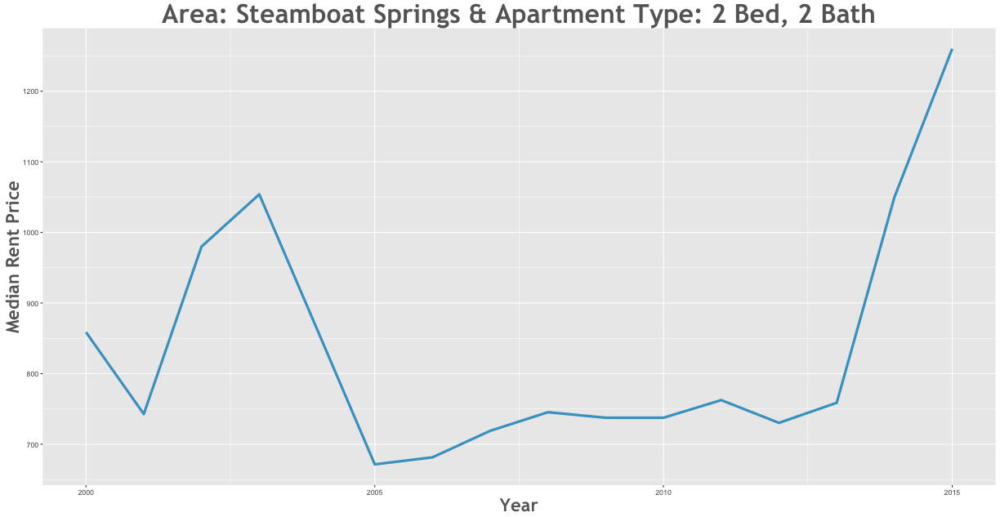

Rent Prices in Steamboat Springs 1996 - 2015
================

Between the 2000 and the 2015 rent increased by 42.87% in the Steamboat Springs area.

Smallest Rent Delta
-------------------

| subregion         | apartmenttype |  delta|
|:------------------|:--------------|------:|
| Steamboat Springs | Efficiency    |      0|

Largest Rent Delta
------------------

| subregion         | apartmenttype |  delta|
|:------------------|:--------------|------:|
| Steamboat Springs | 2 Bed, 2 Bath |  46.75|

